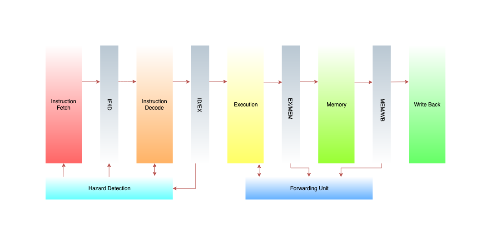

# PipelinedARM
The Arm architecture is a family of reduced instruction set computing (RISC) architectures for computer processors. In this project, a 32-bit pipelined ARM processor is implemented in Verilog HDL.

## The overall architecture

## Implementation
### Stages

ARM pipeline has five stages, with one step per stage:

• IF: Instruction fetch from memory.

• ID: Instruction decode & register read.

• EX: Execute operation or calculate address.

• MEM: Access memory operand.

• WB: Write result back to register.

Each stage takes in data from that buffer, processes it and write into the next buffer. Also note that as an instruction moves down the pipeline from one buffer to the next, its relevant information also moves along with it.

### Instructions

| Instruction Mnemonic | Definition          | 
|----------------------|---------------------|
| MOV                  | Move                | 
| MVN                  | Move NOT            | 
| ADD                  | Add                 | 
| ADC                  | Add with Carry      | 
| SUB                  | Subtract            | 
| SBC                  | Subtract with Carry | 
| AND                  | Logical AND         | 
| ORR                  | Logical OR          | 
| EOR                  | Exclusive OR        | 
| CMP                  | Compare             | 
| TST                  | Test                | 
| LDR                  | Load Register       | 
| STR                  | Store Register      | 
| B                    | Branch              | 

## Dependencies
### macOS
This project needs [Icarus-Verilog](http://iverilog.icarus.com) and a VCD viewer.

## Building on macOS
1. Icarus-Verilog can be installed via Homebrew :
   <code>$ brew install icarus-verilog</code>
2. Download [Scansion](http://www.logicpoet.com/scansion/) from here.  
3. Clone the repository.
4. Run <code>$ make </code> and type MIPS code to see it in binary form in rams_init_file.hex file. 

5. <code>$ make simulate</code> will: 
* compile design+TB
* simulate the verilog design

6. <code>$ make display</code> will: 
*  display waveforms.

## Links
1. [ARM Instruction Set](https://profile.iiita.ac.in/bibhas.ghoshal/COA_2021/lecture_slides/arm_inst.pdf)
2. [Introduction to ARM Instructions (azeria labs)](https://azeria-labs.com/arm-instruction-set-part-3/)

#### TODO

 - ⭕ Add more instructions
